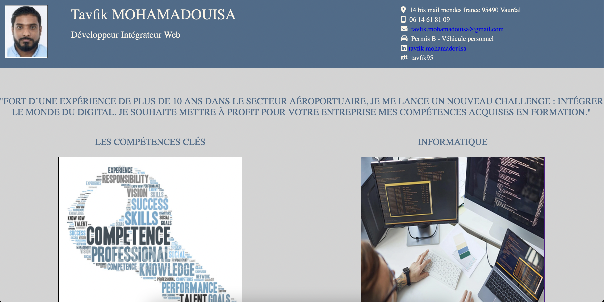

# README
Ce CV numérique est un projet, développé en html et css.  

Il est possible de naviguer sur les différentes pages via les rubriques qui se trouvent sur la page index.html



##### <center> *Fig.1 CV-page d'accueil* </center> <br>


## 1. Installation

Vous devez cloner le dossier avec la commande suivante : 

```bash
$ git clone <repository>
```


## 2. Lancement 

Le projet se lance en ouvrant le fichier "index.html" sur un navigateur. 